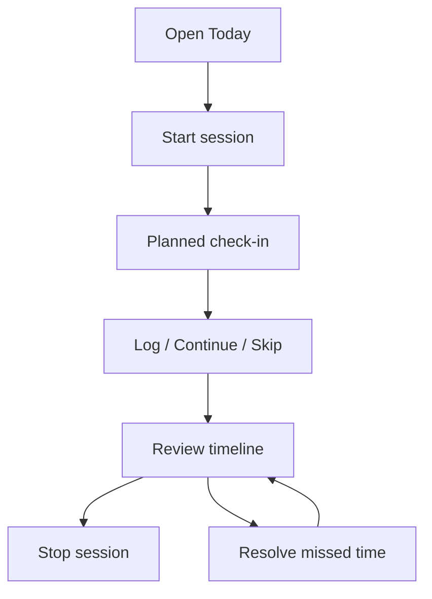
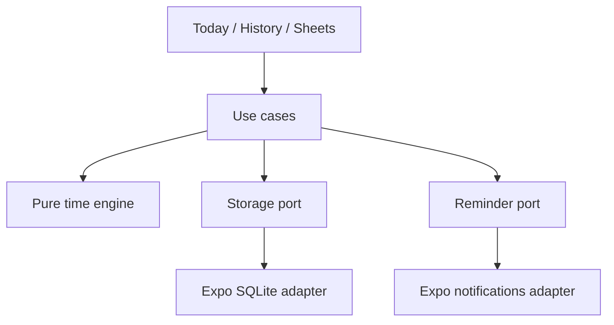

# 15-Minute Time Tracker — Full End-to-End Specification

**Version:** 0.1 design specification

**Date:** 2026-09-22

**First release:** Personal, offline mobile app on Android; iOS uses the same domain and must pass its own real-device gate before release

**Implementation target:** React Native, Expo, TypeScript, Expo SQLite, Expo local notifications

**Related design:** `15-Minute-Time-Tracker-System-Design.md`

This document is the implementation authority where it adds detail to the earlier system design. In particular, the entry action ID and integer revision below are required additions to that design's schema.

## 1. Product contract

The app helps one person answer, **“Where did my time go today?”** The person starts a tracking session, receives approximate 15-minute check-in reminders, records what they did, and sees a timeline that distinguishes recorded, deliberately skipped, and unresolved time. Each action works without an internet connection.

**A successful V0.1:** The user can track three real working days, record most check-ins in seconds, recover missed spans without reconstructing dozens of separate popups, and correct the timeline afterward. The app preserves session and activity data after it is closed and reopened. Scheduled reminder timing is observed on physical devices rather than assumed.

**Product truth:** The user's time entries and session timestamps determine the timeline. A notification is a prompt, never evidence that the user did something. A category does not measure productivity.

### 1.1 Release scope

| In V0.1 | After V0.1 |
| --- | --- |
| Start and Stop; one active session | Multiple simultaneous devices |
| Fixed 15-minute planned boundaries | Changing interval length |
| Bounded reminders for 12 hours | Custom schedules or automatic break detection |
| Log, Continue previous, Skip, Log Now | Voice entry, quick actions, widgets |
| Recover missed completed intervals | Smart suggestions and AI summaries |
| Today, History, day detail, entry edit/delete | Advanced charts and productivity scores |
| Work, Learning, Personal, Break, Other or no category | Custom categories, projects, tags |
| Offline SQLite and notification permissions | Account, backend, sync, web app |

**First post-release priority:** Export to a versioned JSON file and human-readable CSV. Uninstalling the local-only V0.1 can lose its records; the app must not promise permanent backup.

### 1.2 Definitions

| Term | Exact meaning |
| --- | --- |
| Session | A user-started span with one start and one end, at most 12 hours in V0.1. |
| Planned boundary | `session.start + n × 15 minutes`, for integer `n >= 1`. |
| Reminder | OS notification requested for a boundary; may be late or absent. |
| Logged entry | A nonempty description of a real, nonoverlapping span. |
| Skipped entry | A span the user explicitly declined to describe. |
| Unresolved time | Elapsed session time not covered by a live logged or skipped entry. Computed; no placeholder rows. |
| Completed interval | Time before or at the most recent planned boundary; eligible for a check-in proposal. |
| Current partial interval | Time after the latest boundary and before now. Eligible through Log Now, otherwise unresolved. |

## 2. Journey and navigation

Bottom tabs: **Today**, **History**, **Settings**. The Log and Edit forms are sheets. History opens a day-detail screen. Opening an alert navigates to the current unresolved span after the app loads the database; the notification payload does not decide what can be written.

### 2.1 First open and permission

1. Open Today with an empty state: “See where your time goes, one check-in at a time.” Display **Start Tracking**.
2. On the first Start attempt, explain that reminders are local and only requested during a session, then request notification permission.
3. If allowed, Start continues immediately and schedules future reminders.
4. If denied, Start still succeeds; show **Tracking without reminders**, plus an **Open device settings** action. The user can Log Now and use every history feature.
5. Never ask for push credentials, an account, or network access. Recheck permission whenever the app returns to the foreground. On Android, configure the notification channel before the relevant notification permission flow.

### 2.2 Today, idle

Show date, **Not tracking**, Start, and today's recorded/skipped/unresolved totals with any earlier sessions. If the user stopped and restarts later on the same day, create a new session and show both on the same timeline. Empty state shows no invented time before the first session.

### 2.3 Today, active

Show **Tracking**, session start, **Next planned check-in** time, the current incomplete span, **Log Now**, **Stop Tracking**, and today's timeline/totals. Also display **Automatic reminder end** (`started_at + 12 hours`) because V0.1 does not silently promise endless sessions. If reminders are unavailable, show that state without implying tracking itself stopped.

The Next check-in label is a planned time, not a guaranteed delivery ETA. Updating the UI countdown while the app is open must not change the persisted schedule.

### 2.4 Check-in and capture sheet

On a notification tap or an in-app **Resolve** action, open one sheet:

- Exact proposed range and duration, e.g., `10:00–10:45 · 45 min`.
- “What did you do?” input, maximum 500 Unicode characters after trimming; blank is invalid for Save.
- Optional category chips: Work, Learning, Personal, Break, Other. No category is a valid choice.
- **Continue previous** when a previous live logged entry exists. Show its description before tapping.
- **Save**, **Skip this time**, and **Close**. Closing leaves the range unresolved; it never silently skips.

Saving creates exactly one entry for the proposed span. Continue copies the previous description/category into a **new** entry; it never edits the earlier entry. Skip creates one skipped entry. Backfilled entries can span several planned intervals. A later edit can split them by reducing a range and filling the resulting gap; no auto-split workflow is required in V0.1.

After success, close the sheet, refresh totals and timeline, and show a brief confirmation. A duplicate tap refreshes the sheet and cannot create overlapping entries. A database error leaves the sheet open with its draft text intact.

### 2.5 Log Now

Log Now can be used before the next reminder. Default to the most recent uncovered continuous span **ending now**, limited to the current partial interval when older missed time exists. Example: at 10:22 with 10:15 recorded, propose `10:15–10:22`. If the latest boundary is 10:45 and it is now 10:50, propose `10:45–10:50` and leave older missed time to Resolve.

The user may edit the proposed bounds inside the session, subject to nonoverlap. Saving a task switch at 10:22 does not round it to 10:30 or move the future reminder boundary.

### 2.6 Missed reminders

If no entry covers `10:00–10:45` and the user returns at 10:50, offer one proposal for `10:00–10:45`, while `10:45–10:50` stays a current partial interval. If some of that older time was already recorded or skipped, propose only a contiguous uncovered component. If more than one separate gap exists, show one gap at a time, newest first, with an older-gaps indicator. Never create a proposal that crosses an existing live entry.

Closing a missed-time proposal leaves it unresolved. There is no forced sequence of modal dialogs. Returning later may show the proposal again through an explicit unresolved-time card; it must not block navigation.

### 2.7 Stop and final partial span

Stop closes the session at the current instant, capped at the 12-hour window. It does **not** automatically record the final partial span. Show a compact confirmation with the proposed end and unresolved duration; **Stop now** completes in one further tap. A separate **Log final time** option can open a sheet for the uncovered last span before stopping, but it is not required to stop.

After Stop: cancel that session's pending reminders, dismiss its delivered reminders when possible, show a day summary, and remain on Today in idle state. If native cancellation fails after the database closes the session, flag reconciliation for next app open; tapping any stale alert must not restart the session or create an entry. Historical unresolved spans remain editable from the day timeline after Stop.

### 2.8 Edit, delete, and history

Tap a logged entry to edit description, category, start, and end; validate in-session bounds and nonoverlap before saving. Tap a skipped entry to change its span or turn it into a described logged entry. Deleting a live entry removes it from visible history and immediately returns its former duration to unresolved time. Ask for confirmation before Delete. Ordinary UI and export must exclude deleted descriptions.

History lists dates with session duration, recorded time, skipped time, and unresolved time. A day may have multiple sessions. Day detail uses the same chronological timeline and edit sheet as Today. Empty days are omitted from the list. A session crossing midnight appears on both applicable local-day views, each showing only that day's intersection.

### 2.9 Settings

Show current permission and **Reminders enabled** preference. Turning reminders off cancels pending requests; tracking stays active. Turning them on schedules only future, still-eligible boundaries. Show **15-minute check-ins** as fixed and **Maximum reminder window: 12 hours** as explanatory text, not editable controls. Sound/vibration switches are excluded because OS channels, silent mode, and focus settings can override them.

## 3. Time rules and edge cases

1. Persist instants as UTC epoch milliseconds. Use a half-open range `[start_at, end_at)` for every session and entry.
2. Capture the session's starting IANA time zone for context. Render each day with the phone's current time zone in V0.1 and name that choice in the interface if the zone changes. Never change stored instants when the zone changes.
3. A session started at 09:03:20 has planned boundaries at 09:18:20, 09:33:20, etc. The UI may display minutes (`09:03–09:18`) while duration calculations retain seconds. Round **displayed totals only after summing**, to whole minutes; never round individual entries before summing.
4. For active session `S`, `effective_end = min(now, S.reminder_window_end_at)`; for closed session `effective_end = S.ended_at`. The active session becomes closed at `reminder_window_end_at` on the next app reconciliation if no earlier Stop occurred.
5. Check-in target is the latest contiguous unresolved span ending no later than `last_completed_boundary`. If none exists, show the current state rather than creating an empty or overlapping entry. An older unresolved span may still be resolved through its timeline card.
6. `session elapsed = recorded + skipped + unresolved`, calculated after clipping all ranges to the session and selected day. Category totals partition recorded, not session elapsed.
7. No live entries can overlap in one session; adjacent entries are valid. A Save crossing a logged/skipped entry fails with **This time already has an entry** and shows the conflicting span.
8. A user may start a second session only after the previous one is closed. Start pressed twice returns the active session.
9. Session end cannot move earlier than an existing live entry's end without resolving that entry. An earlier cutoff may be corrected; after the 12-hour cap the app does not invent time beyond the cap. A completed session may still accept entries for unresolved time **inside its closed bounds** through day detail.
10. If the device wall clock moves before session start or shows a large discontinuity, stop automatic elapsed-time inference and ask the user to review the session end. Define “large” as a backward move of any amount beyond a one-minute tolerance compared with the last persisted observed wall time, or a forward jump beyond the 12-hour window; normal app inactivity within the window is not an anomaly. This heuristic cannot detect every manual clock change. Existing entries remain untouched.
11. A notification arriving late does not move the target boundary. At 10:50 after the 10:45 due point, it can suggest `10:00–10:45`; `10:45–10:50` cannot be silently included.

### 3.1 Pure interval operations

`unresolved(session, entries, now) = [session.start, effective_end) minus union(live entry ranges)`. Split the result at completed check-in boundaries only to select prompts, and at local midnights only for daily presentation. Store neither the generated gaps nor derived daily totals. This rule enables later category, calendar, or web views without migrating fake placeholder rows.

## 4. Notifications and lifecycle

### 4.1 V0.1 scheduling policy

After Start commits, request **one local notification per remaining 15-minute boundary through the 12-hour cap**, at most 48 for a new session. Content: title “What did you do?”, body “Log your last check-in.” Payload: version, `session_id`, intended `due_at`. Do not include descriptions or categories in notification text/payload.

The schedule is an implementation proposal, **conditional on the real-phone risk probe**. Android may deliver scheduled alerts late, and exact alarm access is restricted on newer releases. The app never claims exact delivery. If a finite schedule fails the probe, replace only the reminder adapter with a tested bounded native strategy; do not silently ship an unlimited repeating alarm. Expo background tasks are not a 15-minute clock.

### 4.2 Reconciliation

Run after Start/Stop, when the app opens or resumes, and after a permission/preference change:

1. Load session truth from SQLite; close an expired active session at the cutoff.
2. Query OS pending requests owned by this app/session and compare intended `due_at` values against future eligible boundaries.
3. Cancel duplicates, expired requests, and requests for closed sessions; create missing future requests if permission is granted and reminders are enabled.
4. Save native request IDs after successful scheduling. If the app crashes between OS scheduling and saving an ID, compare OS payloads before rescheduling so it does not duplicate a request.
5. If scheduling fails, persist session/entry state anyway; display **Reminders unavailable** and retry on resume. Do not fake a reminder success state.

Stop's database commit happens before native cancellation. If the process dies between them, pending requests may briefly survive until reconciliation; the app must never transform a stale tap into a new session or overlapping entry. At the 12-hour cutoff, a tap on the final scheduled prompt routes to the closed day's **unresolved time**, which can still be logged historically. The finite horizon bounds a cancellation failure.

### 4.3 App and device states

| State | Required result |
| --- | --- |
| App foreground at check-in | App may show its in-app check-in prompt; avoid duplicate navigation. |
| Screen locked or app backgrounded | OS delivers scheduled local alert if permitted; app need not execute JavaScript. |
| App terminated by swipe | On tap/reopen, initialize database before resolving route and target span. |
| Android force-stop in system settings | Do not guarantee notifications until manually reopened; show reconstructed timeline. |
| Reboot | Reopen reconciles session and pending alerts; verify actual alert behavior on device. |
| Permission revoked | No assumption of successful delivery; show warning and retain manual logging. |
| Multiple unanswered alerts | Notification tray may contain several; app shows one recovery proposal on open. |
| Expired 12-hour window | No more reminders requested; next app open closes session at cutoff. |

## 5. Persistence, architecture, and interfaces

The system design's `tracking_sessions`, `entries`, `reminder_requests`, and `app_settings` tables are normative. Add a versioned, transactional migration on launch; if migration fails, show a recoverable storage error and **do not** create a fresh empty database over existing user data. Use SQLite foreign keys, indexes by session/time, and exclusive transactions for read/validate/write operations. No screen executes SQL directly.

### 5.1 Use-case contracts

| Use case | Input | Success | Failures handled |
| --- | --- | --- | --- |
| `startSession(now, timezone)` | Current instant and IANA zone | Existing active or new session | Migration/storage failure |
| `getToday(now, timezone)` | Current instant and display zone | Sessions, derived timeline/totals, next boundary | Storage failure |
| `getPromptTarget(sessionId, now)` | Session and current instant | Latest eligible unresolved span or none | Closed/stale session, clock anomaly |
| `createEntry(sessionId, range, text, category, origin, actionId)` | Real range and optional category | One logged row, including historical unresolved time | Invalid text, outside session, overlap |
| `continuePrevious(sessionId, range)` | Target unresolved range | New row with copied prior text/category | No prior entry, overlap, stale target |
| `skipRange(sessionId, range)` | Target unresolved range | One skipped row | Outside session, overlap |
| `updateEntry(entryId, changes)` | Revision observed plus changes | Updated row | Changed by another action, invalid range |
| `deleteEntry(entryId)` | Entry ID and observed revision | Soft deleted row | Already deleted or changed |
| `stopSession(sessionId, now)` | Session and current instant | Closed session, pending cancellation attempted | Clock anomaly, storage failure |
| `reconcile(now)` | Current instant | Correct expired status and desired reminders | Permission denied, OS scheduling failure |

Use a per-action **idempotency key** on create actions (for example a UUID created when the log sheet opens), persisted on entries with a unique index. Repeated Save with the same key returns the existing entry. Overlap checks still protect the timeline when two independent actions target the same span. This is a small schema addition to the earlier system design and makes rapid double taps deterministic rather than merely producing an error.

### 5.2 Modules and boundaries

`domain/time`: interval union/subtraction, day clipping, boundaries, totals. `domain/tracking`: validation and state transitions. `use-cases`: operations above. `storage/sqlite`: migrations, query/repository implementation. `reminders/expo`: permission, scheduled request reconciliation, cold-start tap handler. `features`: UI and local presentation. Keep the pure domain import-free from Expo and SQLite. On a future web client, share the time engine; build a separate web storage/API adapter.

### 5.3 Data contract and migrations

- Client-generated stable UUIDs for sessions and entries.
- UTC integer timestamps; `interval_seconds` and `reminder_window_end_at` snapshotted per session.
- `entries.kind = logged | skipped`; `deleted_at` is a tombstone; `origin` records typed, continued, backfilled, or skipped.
- Add `entries.client_action_id TEXT UNIQUE` for idempotent creation. For schema migration from the initial design, make it nullable for any preexisting rows; require it for newly created entries at the use-case layer.
- Add `entries.revision INTEGER NOT NULL DEFAULT 1`. Editing and deletion increment it with a strict `WHERE id = ? AND revision = ?` condition; report a stale sheet rather than overwriting a newer edit. Retain `updated_at` for display and future sync, not as a collision-prone local revision token.
- `reminder_requests` is disposable operational metadata. Reconstruct it from native pending requests and session boundaries.
- Future export includes a schema version and excludes deleted descriptions by default. Sync is not implemented in V0.1.

## 6. Screen copy, states, and accessibility

| Screen/state | Primary text/action | Empty/error behavior |
| --- | --- | --- |
| Today idle | “Not tracking” / **Start Tracking** | “No activity yet today.” |
| Today active | “Tracking since 09:03” / **Log Now**, **Stop Tracking** | “Reminders unavailable” if OS permission/schedule fails. |
| Check-in | “What did you do?” / **Save**, **Continue previous**, **Skip this time** | Preserve draft and explain overlap/storage error. |
| Unresolved card | “45 min unaccounted for” / **Resolve** | If no completed span exists, show current partial only. |
| History | Day rows and totals | “No previous tracking days yet.” |
| Entry edit | Description/category/start/end / **Save changes**, **Delete** | Exact conflict span if edited bounds overlap. |
| Settings | “Reminders enabled” / OS status | Explain that manual tracking still works when disabled. |

Use platform text scaling, accessible names for icon buttons, 44–48 px minimum tap targets, visible keyboard focus/return behavior, sufficient text contrast, and screen-reader announcements for Save, Stop, conflicts, and permission state. Text input supports the device keyboard and arbitrary user language; V0.1 UI copy may be English. Never rely on category color alone to distinguish entries.

## 7. Privacy, data safety, and reliability

- No login, network access, remote telemetry, third-party analytics, push token, location, screenshot capture, or automatic app-usage observation.
- SQLite is in the app's local storage. Do not claim it is encrypted by default. Notification content is generic; private descriptions remain in the app.
- Use migrations rather than destructive database reset. Surface a storage error rather than claiming Save succeeded. After an OS scheduling error, time entries remain valid and the app says reminders are unavailable.
- Device loss or uninstall can remove local data. Make backup/export an explicit V0.2 priority; do not suggest cloud protection exists in V0.1.
- Optimize for a personal dataset: indexed day/session queries and no precomputed aggregation table. Test several months of realistic entries; move to caching only if measured performance warrants it.

## 8. Test plan and E2E acceptance

### 8.1 Deterministic tests

| Case | Expected result |
| --- | --- |
| Start 09:03:20 | Boundaries 09:18:20, 09:33:20; never reset by a Save. |
| Log 09:03:20–09:18:20 | Recorded = 15m; unresolved = 0 at boundary. |
| 10:00–10:45 missed, reopen 10:50 | One proposal to 10:45; last 5m remains unresolved current. |
| Log Now 10:15–10:22 | Saved 7m; 10:22–10:30 stays unresolved. |
| Continue previous | New row, same text/category, different ID and actual range. |
| Skip 15m | Skipped +15m, recorded unchanged, unresolved -15m. |
| Delete logged 15m | Recorded -15m, unresolved +15m, session time unchanged. |
| Save double tap | One row due to action ID; no overlap. |
| Move entry onto neighbor | Rejected with conflicting span, no partial mutation. |
| Two sessions on one day | Totals sum both; intervening off-session time excluded. |
| Session crosses midnight/DST | Each local day clipped correctly; stored duration preserved. |
| Session reaches 12h while closed | Reopen closes at cap; no extra elapsed time added. |
| Clock set backward | Warning, existing records unchanged, no negative elapsed time. |

### 8.2 Storage and notification adapter tests

Migration from empty DB and one prior schema version; foreign key behavior; one-active-session unique index; persistence after reopen; optimistic edit revision; interrupted transaction rollback; crash after Start DB commit; crash after Stop DB commit; native schedule succeeds but ID write fails; permission changes; stale notification; and expired cutoff. Test reminder adapter with a fake OS scheduler and assert at most one eligible request per future boundary.

### 8.3 Physical-device E2E script

1. Install a development/release-like build on the user's Samsung. If iOS is in release scope, repeat on a physical iPhone.
2. Start with internet off; grant notification permission; press Start at a known timestamp.
3. Lock phone; measure the planned first boundary and actual alert arrival. Tap alert from locked/terminated app; save a description.
4. At next prompt, Continue previous. Verify distinct entries and exact contiguous ranges.
5. Ignore at least two check-ins. Open app; record one consolidated completed gap. Confirm the current partial interval is not included.
6. Use Log Now before a boundary, then save another activity later. Verify no forced rounding or overlap.
7. Skip a span, delete another, edit one entry, and verify `recorded + skipped + unresolved = session elapsed` each time.
8. Stop; inspect pending alerts and wait past a planned boundary. The stopped session must not generate another intended alert.
9. Kill/reopen and reboot/reopen; history and the appropriate active/closed state persist. Test notification permission denied, then reenabled.
10. Test near the 12-hour cap (use controlled timestamps for domain logic and one real-device bounded-schedule test); no alerts are requested beyond cap. Test a stale notification tap after Stop.

For each physical run, record device model, OS version, notification permission/battery setting, planned due times, actual delivery times, missed alerts, and whether the user found the prompts tolerable. A genuine 15-minute user experience depends on this evidence. On Android, exact alarm permission is denied by default for many fresh installs, and repeating alarms are inexact; do not promote a simulator-only check into a delivery guarantee.

### 8.4 Release gates

**Functional:** Every action above succeeds offline on the supported phone; data survives force close/reopen; no live entries overlap; the time-balance identity holds across edits, skips, deletes, sessions, and local midnight; stale taps are harmless; denied notifications still allow full manual tracking.

**Reminder:** The bounded scheduling and cancellation workflow is verified on the target device. Publish the observed lateness and delivery failures from at least two full working-day trials rather than promising exact arrival. If reminders repeatedly fail under normal settings, V0.1 is blocked until a tested scheduler or a revised product promise exists.

**Usability:** Three working days of personal use; normal Continue action takes no typing and a text Save is not forced through multiple screens. Record friction points and whether 15 minutes should remain the default.

**iOS gate:** Run the same locked, terminated, permission-denied, missed-gap, cutoff, and Stop checks on a physical iPhone before claiming iOS support. An Android-only internal release can proceed without that claim.

## 9. Implementation slices

1. **Notification risk probe:** Decide whether 48 bounded, scheduled local reminders are viable on the actual device. Keep code throwaway until the adapter choice is proven.
2. **Domain engine:** Time windows, gaps, boundaries, daily clipping, session cap, overlap and time-balance tests.
3. **SQLite:** Tables, migration version, repositories, idempotency, transactions, soft delete and edit revision.
4. **Today loop:** Start/Stop, Log Now, check-in sheet, Continue, Skip, live totals and timeline.
5. **Recovery and reminders:** Permission flow, OS scheduling reconciliation, cold-start tap, expired sessions, missed time.
6. **History/edit and quality:** Previous days, entry corrections, accessibility, performance with realistic data, physical-device E2E and three-day trial.

Each slice ends with a working app and evidence for its relevant acceptance cases. Do not build sync, a backend, or a web app to satisfy a V0.1 gate.

## 10. Evolution contract

Later web access should initially **read** account-backed history; writable web needs cross-device conflict handling. Future sync can use stable IDs, timestamps, tombstones, and a local outbox, but must detect overlapping time edits rather than blindly choosing the newest write. Notifications remain device responsibilities. A future server adds authenticated owner scoping and incremental change exchange; it never redefines the user's recorded time.

## 11. Platform references checked on 2026-09-22

- Expo local notifications, permissions, scheduling, cancellation, and handling: https://docs.expo.dev/versions/latest/sdk/notifications/
- Expo notification behavior and Android force-stop: https://docs.expo.dev/push-notifications/what-you-need-to-know/
- Expo SQLite persistence and transactions: https://docs.expo.dev/versions/latest/sdk/sqlite/
- Expo background task timing limitations: https://docs.expo.dev/versions/latest/sdk/background-task/
- Android alarm scheduling: https://developer.android.com/develop/background-work/services/alarms
- Android 14 exact alarm permission: https://developer.android.com/about/versions/14/behavior-changes-all
