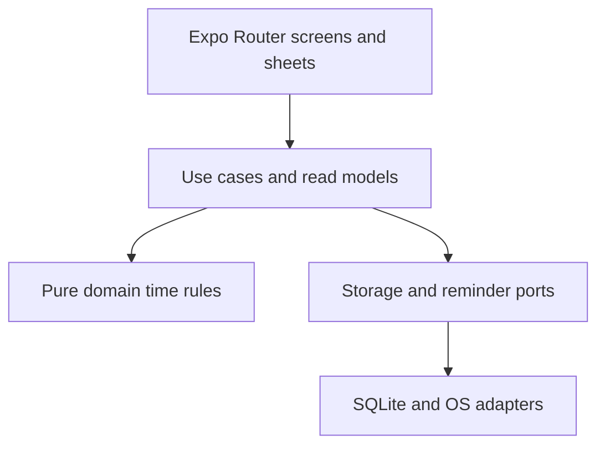

# Back15 V0.1 implementation architecture

**Status:** Execution guide for the existing Expo app foundation. Read with the [E2E spec](e2e-spec.md) and [system design](../system-design.md); these documents define behavior and time/data rules. The [design guide](design.md) defines presentation.

## Scope and dependency direction

One local mobile app, one device, one active session, no backend. Use a small layered architecture so changes to native reminder APIs or future sync cannot change the meaning of recorded time.

Dependency rule: `domain` imports only standard TypeScript; use cases depend on interfaces and domain types; adapters implement those interfaces; routes/features call use cases and render read models. Neither screens nor reminder callbacks issue direct SQL or derive their own version of a gap.

### Proposed file map (add as code is built)

| Directory | Responsibility |
| --- | --- |
| `app/` | Expo Router Today/History/Settings, day detail and capture/edit routes or sheets; lifecycle wiring |
| `src/domain/time/` | Half-open intervals, unions/subtraction, boundaries, cutoff, local-day clipping, duration aggregation |
| `src/domain/tracking/` | Session and entry types, invariant checks, pure proposals and state transitions |
| `src/use-cases/` | Start/Stop, getToday, target selection, create/continue/skip/update/delete, reconciliation |
| `src/storage/` | Versioned SQLite migrations, parameterized queries, transactions, repository interface implementation |
| `src/reminders/` | Notification permission/channel, bounded schedule, pending request reconciliation, tap handling |
| `src/features/` and `src/components/` | View models and reusable native presentation |
| `src/theme/` | Design tokens and typography implementation |

The existing `app/(tabs)` screens and `src/theme/palette.ts` are scaffold only. Avoid building a monorepo, backend, outbox or generalized plugin framework before the app has a second client.

## Write contracts and durable state

SQLite owns `tracking_sessions`, `entries`, `reminder_requests` metadata and `app_settings` as specified in [system design](../system-design.md#4-sqlite-schema). Apply the E2E spec's additions to `entries`: nullable `client_action_id TEXT UNIQUE` for a migration from any preexisting rows (required on new creates at the use-case layer) and `revision INTEGER NOT NULL DEFAULT 1` for optimistic edits/deletes. Use `PRAGMA user_version`, `foreign_keys = ON`, indexes and safe versioned migrations; never drop a user's data after a failed migration.

| Operation | Transactional truth | After commit / recovery |
| --- | --- | --- |
| Start | Reconcile expired active state; insert one active session with start UTC ms, IANA zone, `interval_seconds=900`, 12-hour reminder end. Duplicate Start returns the active session. | Ask reminder adapter to reconcile its finite future schedule. Permission failure leaves tracking active. |
| Create / Continue / Skip | Stable action ID; validate exact half-open range inside session and against live entry overlap; insert one logged or skipped row. Retry of the same ID returns the same result. | Refresh derived day read model; no reminder timestamp changes. |
| Edit / Delete | Check known integer revision and live overlap in the same transaction; increment revision, or set `deleted_at`. Return a conflict on stale revision. | Recalculate uncovered time from live entries; do not write placeholder gaps. |
| Stop | Set `ended_at` and `status=closed`, capped at horizon; preserve final partial time as unresolved. | Cancel/dismiss owned OS requests; retry orphan cleanup on next launch. |

SQLite write ordering and transaction mechanism must be confirmed against the installed `expo-sqlite` API during implementation. Use an exclusive transaction for read/validate/write so two rapid saves cannot both pass overlap checks; the unique action ID protects retries of the same button press. Never use an in-memory timer as a substitute for a committed session.

## Time and projection rules

Stored instants are UTC epoch milliseconds; all recorded spans use `[start_at, end_at)`. `effective_end = min(now, reminder_window_end_at)` for an active session and `ended_at` for closed sessions. Planned boundary `n` is `started_at + n * interval_seconds * 1000`. A late answer never shifts the series. Do not infer that a reminder was delivered because its due time passed.

Generate the day read model by clipping sessions and live entries to the chosen local-day window, subtracting their union from covered session windows, and marking each uncovered component as unresolved. Distinguish explicitly skipped entries. Category totals partition **recorded** time only. Compute `recorded + skipped + unresolved = elapsed session time` before rounding display totals. If the session crosses midnight or DST, clip by actual instants in the current device time zone. Do not store precomputed daily summary rows.

**Prompt selection:** A reminder tap proposes the latest contiguous unresolved completed span ending at or before the latest completed boundary. Older gaps stay reachable on Today/day detail; do not cross an existing entry and do not show several mandatory popups. **Log Now** proposes the latest uncovered partial span ending at `now`, limited to the current boundary when older completed gaps remain. User-edited bounds go through the same invariant checks. Continue previous creates a distinct entry with copied description/category; Skip stores explicit skipped time.

For the selected visual sample, at 10:21 after starting at 09:03, the current interval is 10:18–10:33 and the countdown is 12 minutes. Four prior logged intervals total 60m; a missing 10:03–10:18 adds 15m and the unfinished 10:18–10:21 adds another 3m of unresolved time. The screenshot's `15m open` must not become the all-unresolved total.

## Reminders and lifecycle

On Start, the proposed native adapter requests a maximum of 48 local notifications at future session boundaries through `start + 12h`. Each has a generic title/body and versioned `{session_id, due_at}` payload; never include activity text. Save native request IDs as disposable reconciliation metadata. Check permission and the user's reminder preference; a denied/disabled reminder state keeps manual tracking fully usable.

On app initialization and foreground, after Start/Stop, and on permission change: open/migrate the DB first; close an expired session at its cutoff if needed; compare active session boundaries to OS pending requests; cancel duplicates/orphans/expired requests; schedule missing eligible requests. When a notification is tapped from a cold start, load the current session and compute the target again instead of trusting payload time. A stale alert cannot reopen a closed session. Schedule and cancellation failures are visible to the user and retried at the next opportunity; they do not roll back committed entries.

The 48-request strategy is **a risk to test**, not a delivery guarantee. Probe the actual Android device for locked, backgrounded, terminated, rebooted and power-saved states; record planned vs observed arrivals. If it fails, change the reminder adapter and re-run the same behavioral tests. Do not introduce an endless repeating reminder or rely on `setInterval` while backgrounded. Clock discontinuities need an explicit review state; avoid rewriting historical time automatically.

## Verification and handoff

| Layer | Evidence to produce |
| --- | --- |
| Domain | Deterministic tests for anchored boundaries, partial Log Now, gaps, overlap, skip/delete, retries, cutoff, midnight/DST and balance identity |
| SQLite | Migration/rollback, one-active constraint, action ID/revision, transactional overlap, persistence after restart |
| Reminders | Fake adapter tests for finite schedule, crash between OS request and ID write, denied permission, orphan cleanup, stale tap |
| UI | Real state vs example data, accessible controls, keyboard/safe areas, idle/active/error/missing-time flows |
| Real phone | Two full working-day reminder observations, stopped-session cancellation, locked/cold-start tap, reboot/reopen, three-day personal trial |

Until the physical-device evidence exists, describe notification behavior as unverified. The first release can target Android; do not claim iOS is tested until its own physical-device gate passes. On ARM64 Linux, a `--no-bytecode` Expo export is a JS bundle diagnostic only, not a Hermes release verification.

## Later growth

Export/versioned import is the first follow-up because uninstall can remove local data. A future web client can reuse pure time/domain rules and add its own data adapter; write-capable sync needs authenticated owner scoping, client IDs, revisions, a local outbox and explicit overlap-conflict resolution. Keep the V0.1 app and its SQLite persistence independent of that later decision.
