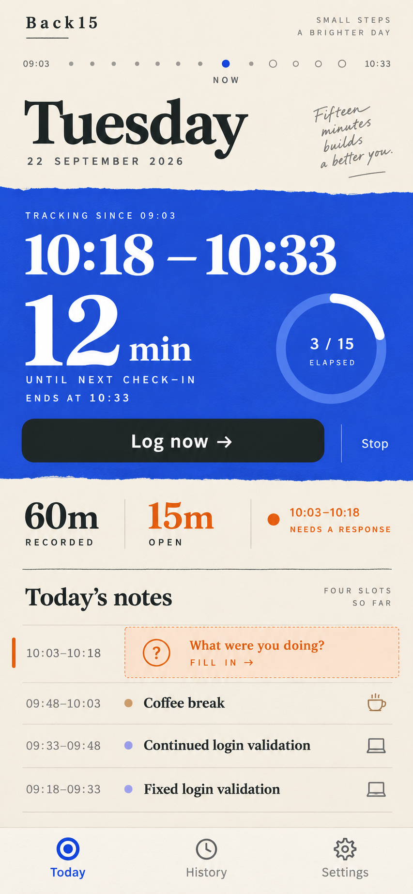

# Back15 V0.1 design guide

**Status:** Selected visual direction for MVP implementation, not an implemented screen. Product rules are in [E2E spec](e2e-spec.md); code boundaries are in [architecture guide](architecture.md).

## Selected Today reference

This is the user-selected **field notes** direction for Back15. Preserve the memorable combination of warm paper, editorial type, a strong cobalt tracking area and a restrained orange prompt for missing time. Treat the image as art direction. Build a responsive, accessible native screen from actual state; do not ship the PNG as the interface, reproduce rasterized text, or hardcode its sample data.

### Fidelity priorities

1. Date and Back15 identity sit on a calm warm canvas. The day feels like a journal of what actually happened, rather than a task dashboard.
2. A vivid cobalt active area makes the current time window, minutes to next **planned** check-in, and **Log now** unmistakable. Stop is secondary but plainly accessible.
3. Session totals read as a compact ledger, not a chart. Unresolved completed time draws orange attention without guilt or a productivity score.
4. One timeline shows the gaps and recorded activities in chronological order. Tapping a gap opens the same capture sheet used by a reminder; tapping an entry opens Edit.
5. Three bottom tabs: Today, History, Settings. Reuse this visual language on the capture and edit sheets and on idle/History states; avoid a completely different theme per screen.

### Visual tokens to start from

| Role | Approximate starting value | Use |
| --- | --- | --- |
| Warm background | `#F8F5ED` | Reading surface and idle states |
| Ink | `#1E2525` | Body copy, high-contrast primary text and dark action |
| Cobalt | `#1F50D8` | Active tracking surface, selected navigation and key focus |
| Orange | `#C94E14` | Missed-time text, marker and resolve action only |
| Muted text | `#6A716F` | Secondary copy; verify contrast on both backgrounds |
| Rule | `#DAD9D1` | Time row separation and subtle dividers |

These are starting points sampled visually from the concept, **not** signed-off hex values. Centralize actual implemented tokens in `src/theme/palette.ts` and reusable type/spacing definitions. Use a display serif for major date/time headings and a highly legible sans for body, controls, form fields and numeric labels. The current starter palette is green and will need updating when implementation begins. Avoid adding fonts until a real device preview shows the need; account for platform font metrics.

## Behavior behind the pixels

- The date, session state, countdown, next boundary, progress, rows and totals come from SQLite-backed read models and the device clock while foregrounded. Never persist a ticking countdown or let it reschedule the OS reminder.
- A session started at 09:03 has due boundaries at 09:18, 09:33, 09:48, 10:03, 10:18 and 10:33. At 10:21, the current window is 10:18–10:33, 3 of 15 minutes have elapsed, and the next planned check-in is in 12 minutes. Actual notification arrival may be later.
- The selected mockup is **illustrative**, not an accounting fixture. At 10:21 after four logged 15-minute blocks and a missed 10:03–10:18 block, recorded = 60m, completed missing = 15m, current unfinished = 3m, and total unresolved = 18m. Label `15m needs an answer` if displaying only completed missing time; label `18m unresolved` if displaying all uncovered time. A daily summary must satisfy `session time = recorded + skipped + unresolved`.
- The image's “four slots so far” and decorative dots are not exact: five boundaries have been completed at 10:18. Either derive a correct count from session timestamps or omit it. Render dots or progress from actual boundaries, not an arbitrary illustration.
- The handwritten encouragement in the image is optional ornament. Avoid guilt or invented productivity claims. Prefer useful, calm copy such as “A record of your day.” A user can track a Break without judgment.
- Some user days have no gap, some have several, and some have skipped spans. Do not render an orange warning for a resolved day; if several noncontiguous gaps exist, offer one actionable gap at a time and an accurate remaining count.

## Screen and state inventory

| Surface | Required primary state | Useful variants |
| --- | --- | --- |
| Today tab | Active session, next planned time, Log now, Stop, recent timeline | Idle with Start; denied reminders; long session/cutoff; offline; storage/scheduling error |
| Capture sheet | Exact range, description, Continue previous when possible, optional category, Save/Skip | Missed consolidated span, Log Now partial span, stale/overlap error, keyboard raised |
| Edit sheet | Existing range, description/category, Save/Delete | Revision conflict, skip-to-logged, tombstone |
| History tab and day detail | Previous dates and accurate session/day totals | Empty history, multiple sessions, midnight clipping |
| Settings tab | Reminder permission/state, fixed 15-minute cadence and 12-hour horizon | Permission denied/revoked; preferences switched off |
| Permission explainer | Why local reminders are requested on first Start | Denied path continues tracking |

## Native implementation constraints

- Phone-first layout, safe areas and a reachable primary action. The reference is tall; on shorter screens the recent timeline scrolls while the action and tab bar remain usable. Avoid covering entry rows with the keyboard or bottom navigation.
- Dynamic Type, large system fonts, VoiceOver/TalkBack names, predictable focus order, at least 44–48 px touch targets, sufficient contrast and descriptive status text alongside colors/icons. Check orange on warm paper and muted text on cobalt in real screenshots.
- Bottom tabs are navigation. Editing, stopping, permission explanation and capture use focused sheets/dialogs where appropriate; no extra feature tabs, charts, projects or dashboards in V0.1.
- Validate on the user's real Android device, plus a physical iPhone before claiming iOS support. The chosen image is a visual goal, not proof of implementation or notification behavior.
