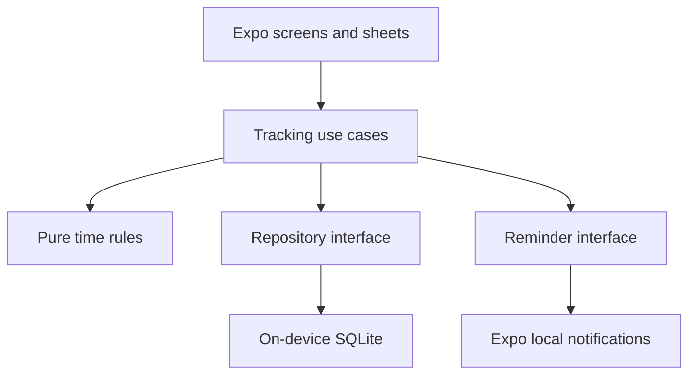
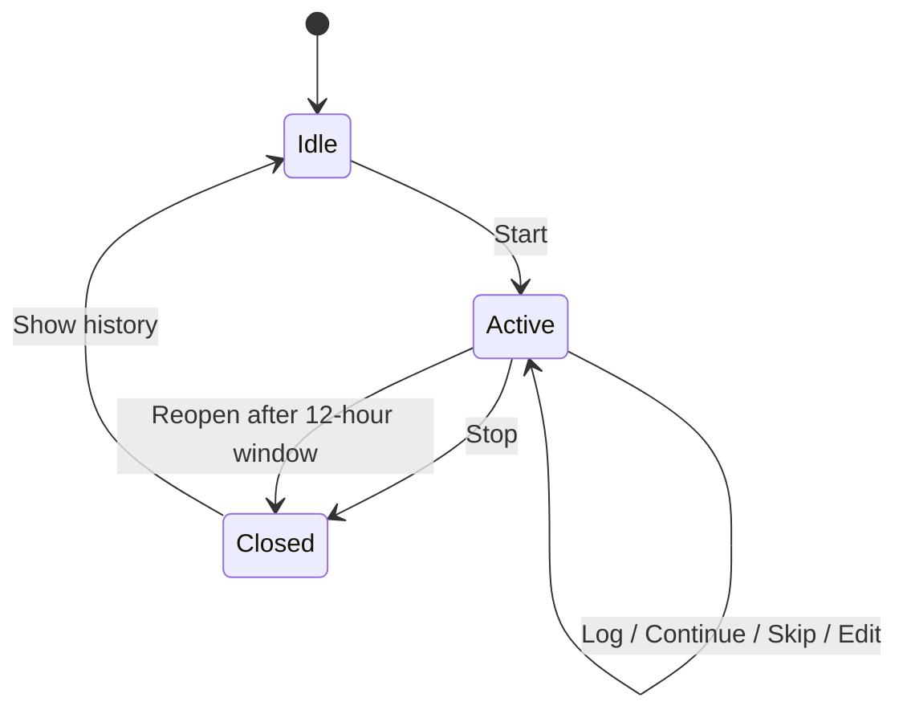

# 15-Minute Time Tracker — System Design

**Status:** Design for V0.1 personal mobile release

**Date:** 2026-09-22

**Target:** React Native + Expo, one user, offline on one phone

**Purpose:** Make the first version dependable while leaving clean paths to export, sync, and a web client.

## 1. Design decisions

1. **SQLite owns time and activity data.** A reminder never creates a time record by itself.
2. **Activities have real start and end instants.** Fifteen minutes defines check-in cadence, not the only legal activity length. A task switch at 10:22 can be represented accurately.
3. **Unaccounted time is calculated from uncovered time in a session.** A skipped period is an explicit decision and is stored separately from an unreported gap.
4. **One active session per device.** A session has a 12-hour maximum reminder window in V0.1. On next app open, a session past that limit closes at the limit and the user can correct its end time.
5. **Native scheduled local notifications handle reminders.** The app never relies on a JavaScript timer running in the background. Delivery may be late or suppressed by the OS; check-in boundaries remain anchored to session start.
6. **Local first.** No account, network dependency, backend, analytics SDK, or synchronization machinery in V0.1.
7. **Portable domain.** Calculations and rules live in plain TypeScript without Expo or UI imports. A web client can reuse the rules later; the mobile app keeps its own SQLite adapter.

### Scope boundary

V0.1: start/stop, fixed 15-minute check-ins, log/continue/skip, missed-time recovery, timeline, editing, previous days, totals, permission handling, local storage. Keep custom categories, flexible cadence, cloud sync, and advanced reports for later. A JSON/CSV export should be the first follow-up because a device-only database can be lost when the app is removed or the device is lost.

## 2. Runtime architecture



| Layer | Owns | Must not own |
| --- | --- | --- |
| UI | Today, History, settings, log and edit sheets | Gap calculations or direct SQL |
| Tracking use cases | Start/stop/log/continue/skip, transaction boundaries, reconciliation | Presentation or platform-specific notification APIs |
| Pure domain | Session windows, next due time, interval unions, gaps, daily totals | React Native, SQLite, notification side effects |
| SQLite repository | Migrations, constraints, durable reads and writes | Timing policy |
| Reminder adapter | Permission checks, schedule/list/cancel/dismiss requests | Activity creation or time totals |

Use a single app repository at first. Organize under `src/domain`, `src/use-cases`, `src/storage`, `src/reminders`, `src/features`, and `app` (routes). Extract `domain` to a shared package **when a second client exists**. No microservices, event bus, or monorepo are needed now.

## 3. Time model

- Store every instant as a UTC epoch millisecond integer. Display using the device's current IANA time zone; retain `start_timezone` on the session for later audit of changed zones. Never store only `09:15` or use a local date as the record identifier.
- Treat all ranges as **half-open** `[start_at, end_at)`. Adjacent entries may touch; they must never overlap within a session. An entry must be wholly inside its session's effective duration.
- Each session snapshots `interval_seconds = 900`. Later changing a preference must not change past sessions.
- Check-in boundary `n` is `started_at + n × interval_seconds`, for positive integer `n`. Saving late never shifts this anchor. The `next_due_at` display is computed, not persisted as another source of truth.
- Notifications are **approximately** every 15 minutes; due boundaries are exact calculations. The OS can deliver a notification late.
- A session started at 09:03 has boundaries at 09:18, 09:33, and so on. The current unfinished portion remains visible and unreported until saved.
- Daily views intersect entries and uncovered ranges with local midnight boundaries. A session crossing midnight produces time on both days. A time-zone change may make a day unusually long or short; calculate from instants, not a fixed 24-hour assumption.

### Totals

For the selected day and each session, clip to `[started_at, min(ended_at or now, reminder_window_end_at))`. Then:

`session time = recorded time + skipped time + unresolved time`

`recorded time` includes Work, Learning, Break, and uncategorized entries. Category totals partition recorded time; do not label recorded time “productive.” `unresolved` includes gaps and a currently unfinished interval; the UI may label its recent part “current” and the older part “missed.” Deliberately skipped time remains separate from never answered time. Every number uses range unions to prevent double counting.

## 4. SQLite schema

```sql
PRAGMA foreign_keys = ON;

CREATE TABLE tracking_sessions (
  id TEXT PRIMARY KEY,                   -- client-generated UUID
  started_at INTEGER NOT NULL,           -- UTC epoch milliseconds
  ended_at INTEGER,                      -- null while active
  reminder_window_end_at INTEGER NOT NULL,
  interval_seconds INTEGER NOT NULL DEFAULT 900,
  start_timezone TEXT NOT NULL,
  status TEXT NOT NULL CHECK (status IN ('active', 'closed')),
  created_at INTEGER NOT NULL,
  updated_at INTEGER NOT NULL,
  CHECK (interval_seconds > 0),
  CHECK (reminder_window_end_at > started_at),
  CHECK (ended_at IS NULL OR ended_at >= started_at),
  CHECK ((status = 'active' AND ended_at IS NULL)
      OR (status = 'closed' AND ended_at IS NOT NULL))
);

CREATE UNIQUE INDEX one_active_session
ON tracking_sessions(status) WHERE status = 'active';

CREATE TABLE entries (
  id TEXT PRIMARY KEY,
  session_id TEXT NOT NULL REFERENCES tracking_sessions(id),
  start_at INTEGER NOT NULL,
  end_at INTEGER NOT NULL,
  kind TEXT NOT NULL CHECK (kind IN ('logged', 'skipped')),
  description TEXT,
  category TEXT,                          -- work, learning, personal, break, other
  origin TEXT NOT NULL CHECK (origin IN ('typed', 'continued', 'backfilled', 'skipped')),
  created_at INTEGER NOT NULL,
  updated_at INTEGER NOT NULL,
  deleted_at INTEGER,
  CHECK (end_at > start_at),
  CHECK ((kind = 'logged' AND length(trim(coalesce(description, ''))) > 0)
      OR (kind = 'skipped' AND description IS NULL AND category IS NULL))
);

CREATE INDEX entries_by_session_time ON entries(session_id, start_at, end_at);
CREATE INDEX sessions_by_start ON tracking_sessions(started_at DESC);

CREATE TABLE reminder_requests (
  session_id TEXT NOT NULL REFERENCES tracking_sessions(id),
  due_at INTEGER NOT NULL,
  native_request_id TEXT,                 -- filled after OS schedule succeeds
  PRIMARY KEY (session_id, due_at)
);

CREATE TABLE app_settings (
  key TEXT PRIMARY KEY,
  value TEXT NOT NULL
);
```

An explicit migration version is kept with SQLite `PRAGMA user_version`. Use parameterized queries for user input. Enable foreign keys on every connection. WAL is a reasonable default for local reads and writes. Use an exclusive transaction for mutations that read, validate, and write time spans.

The app enforces that live entries lie within their parent session and do not overlap any other live entry. In the same write transaction, check for an intersecting row using `existing.start_at < proposed.end_at AND proposed.start_at < existing.end_at`; reject conflicts. Queries, totals, and exports exclude `deleted_at IS NOT NULL`. Soft deletion makes an entry's former span unresolved immediately and leaves a path for future sync tombstones. Do not expose deleted content in normal export.

The `reminder_requests` table is **reconciliation metadata**, not authoritative time data. All mutation operations are idempotent at the use-case boundary: a repeated tap cannot create an overlapping second record.

## 5. Session and logging behavior



**Start:** In an exclusive transaction, reconcile an expired active session and create one new active session with a UUID, start instant, zone, 15-minute interval, and 12-hour reminder end. A duplicate Start reads the existing active session. After commit, reconcile pending OS reminders. If scheduling or permission fails, keep tracking active and show “Reminders unavailable”; allow manual capture.

**Normal check-in:** A tap opens a log sheet for the latest unresolved completed check-in span. If the user has missed multiple boundaries, show a single proposed span covering those unresolved completed intervals. The user may split it into multiple entries later. Do not overwrite recorded or skipped spans while consolidating.

**Continue:** Copy the most recent live logged description and category into a new entry for the proposed unresolved span. Preserve the previous entry. If the span was filled by another action, refresh the sheet and do not duplicate it.

**Log Now:** Open a sheet with a proposed range from the last boundary or latest entry end to the current instant. Let the user adjust it; store the actual end instant (for example 10:22), leaving 10:22–10:30 unresolved until the next action. A task change is therefore not rounded to a quarter-hour.

**Skip:** Store a `skipped` entry for the selected unresolved span. Never automatically turn unanswered time into a deliberate skip.

**Edit/Delete:** Edits pass the same bounds and overlap checks. Deletion sets `deleted_at`, so the covered time reappears as unresolved. Entries of zero duration are invalid. An earlier session end can be corrected only after resolving entries extending beyond the new end; present those conflicts instead of silently truncating them.

**Stop:** Commit `ended_at = now` (clamped to the reminder window if expired) and `status = closed`; include the final partial interval as unresolved unless the user logs it. Then cancel and dismiss that session's reminders. On an app crash between the DB commit and OS cancellation, startup reconciliation cancels orphans. A stale alert might still appear before then; tapping it reads session state and never reopens the closed session.

**Forgot to stop:** Only schedule prompts within 12 hours of the session start. On the next app open after that cutoff, close the session at the cutoff and ask if its actual end was earlier. This prevents the app from inventing overnight hours. Longer sessions require an explicit Extend action before the cutoff; V0.1 can omit Extend if 12 hours is acceptable for personal testing.

## 6. Reminder delivery and recovery

**V0.1 proposed scheduling:** On Start, schedule one local notification for each 15-minute boundary within the 12-hour window (48 maximum). Each payload carries `session_id` and the **intended** `due_at`; it contains no description or private work text. This finite set ends without waking JavaScript. Store each returned native request ID. On resume, compare native pending requests against the active session and repair missing, duplicate, or obsolete requests. If a crash occurs after scheduling and before recording the ID, inspect OS pending notification payloads before adding another. Stop cancels every pending request belonging to the closed session, including any orphan without a stored ID.

This is a **design choice to validate on physical phones**, especially Android's handling of scheduled triggers and power saving. If a 48-request schedule cannot deliver acceptably on the target devices, keep the reminder adapter boundary and test a repeating native trigger or a platform-specific bounded scheduler. A repeating trigger without a bounded stop policy is unacceptable because it may keep prompting long after the user forgets to stop. Do not claim minute-exact arrival.

**Notification tap:** Initialize database; read the session and current clock; compute unresolved ranges now; navigate to the relevant log sheet. Treat payload time as a hint. If it references a closed session or old resolved interval, show the current state rather than attempting a duplicate write. Handle both a running app and a cold start.

**App open / foreground:** Reconcile expiration, entries, current permission, and pending notifications. If notifications are denied, retain manual tracking and show a clear banner. If Android force-stop, power saving, restart, or iOS settings interfere, app state still reconstructs from SQLite on reopen. Do not use background tasks as a 15-minute clock; Expo documents that they are inexact.

**Clock changes:** UTC wall-clock instants are persisted; wall-clock changes can still invalidate elapsed-time assumptions. If now is before session start or jumps far beyond the expected window, freeze automatic reconciliation and ask the user to confirm or correct end time. Do not silently rewrite previous entries. Time-zone changes alone only change display grouping.

## 7. Screens and read models

- **Today:** state, Start/Stop, next *planned* boundary, Log Now, recorded/skipped/unresolved totals, chronological ranges.
- **Log sheet:** proposed range, text field, Continue previous, optional category, Skip. Show a single missed-time range by default and permit later splits.
- **Entry sheet:** edit, delete, adjust start/end with overlap validation.
- **History:** days with recorded totals; tapping a day opens that day's timeline, including sessions crossing midnight.
- **Settings:** notification permission/status and explanation; keep 15-minute cadence fixed in V0.1.

No precomputed daily totals table is required. At personal-use scale, calculate them from SQLite range queries and pure time functions. Cache only in UI if measurement shows a problem; invalidate on writes.

## 8. Failure behavior and verification

| Situation | Required behavior |
| --- | --- |
| Permission denied | Session and manual logging work; warning persists; zero reminders scheduled. |
| App terminated or phone locked | Pending local alerts are delivered if OS allows; database is restored on reopen. |
| Android app force-stopped | Do not promise delivery until user reopens; recover timeline then. |
| Duplicate tap or duplicate alert | Recompute unresolved span and reject overlapping writes. |
| No answer for 45 minutes | One editable missed-time proposal, no three mandatory dialogs. |
| App closed during Start/Stop scheduling | Next open reconciles DB session state with OS pending requests. |
| Reboot or clock change | Reconcile on next open; avoid invented intervals. |
| Midnight or DST transition | Split display by local day; preserve original instants and durations. |
| 12-hour cutoff reached | No more planned prompts; reconcile a closed session at cutoff on next open. |

**Core tests:** deterministic domain tests for gaps, overlaps, partial intervals, late logging, editing, midnight/DST, expired sessions, and totals; SQLite migration/constraint tests; notification adapter tests with a fake scheduler. **Real-phone acceptance:** run a full working day on the target Samsung and an iPhone if iOS is in release scope; cover permission denial, locked screen, several ignored reminders, swipe-away, reboot, stop, expired session, and cold-start notification tap. Record planned boundary and observed alert time so the notification claim is based on measured behavior.

## 9. Future evolution without a rewrite

| Stage | Addition | Existing boundary reused |
| --- | --- | --- |
| V0.2 | JSON and CSV export, optional import with schema version | SQLite repository and portable domain types |
| V0.3 | Projects/tags and optional custom intervals | New tables/settings; old session snapshots stay immutable |
| V1 sync | Opt-in account, authenticated API, per-device local outbox, incremental sync, tombstones | UUIDs, `updated_at`, `deleted_at`, repository contract |
| Web | Read-only history and reports first, write support after conflict handling | Pure TypeScript calculations and API contracts |

Sync is a separate product decision, not a hidden V0.1 dependency. When introduced, every write needs a stable client ID, server identity, authorization, revision or change cursor, and an offline outbox. **Do not use blind last-write-wins for time ranges:** simultaneous mobile and web edits can overlap. Reconcile nonconflicting changes automatically; surface conflicting time edits for user choice. For a multi-user version, scope every server query to the authenticated owner and enforce it in the database/API. Keep device notifications local; a cloud server should not become the source of truth for past time spans.

## 10. Delivery sequence

1. **Risk probe:** local scheduled alert on the actual phone, locked, app terminated, restart, cancel, and a 12-hour finite schedule; measure lateness. This decides the reminder adapter's implementation.
2. **Domain + SQLite:** sessions, entries, interval/gap and daily projection, migrations, idempotent writes.
3. **Core UI:** Today, log sheet, Continue, Stop, edit, History.
4. **Reconciliation:** denied permissions, duplicate taps, missed time, cutoff, clock anomaly, notification tap from cold start.
5. **Personal trial:** use the app for three real days; evaluate answer time, missed check-ins, notification lateness, and whether 15 minutes feels sustainable.

**Release gate:** recorded + skipped + unresolved equals elapsed session time for every day; no overlapping live entries; no reminder remains intentionally scheduled after Stop; the app survives closing and reopening; finite reminders do not continue overnight; the real-device notification behavior is documented rather than assumed.

## Sources checked (2026-09-22)

- Expo Notifications: https://docs.expo.dev/versions/latest/sdk/notifications/
- Expo notification behavior: https://docs.expo.dev/push-notifications/what-you-need-to-know/
- Expo SQLite: https://docs.expo.dev/versions/latest/sdk/sqlite/
- Expo Background Task: https://docs.expo.dev/versions/latest/sdk/background-task/
- Android alarm scheduling: https://developer.android.com/develop/background-work/services/alarms
- Android 14 alarm permission: https://developer.android.com/about/versions/14/behavior-changes-all
- Expo Sharing: https://docs.expo.dev/versions/latest/sdk/sharing/
